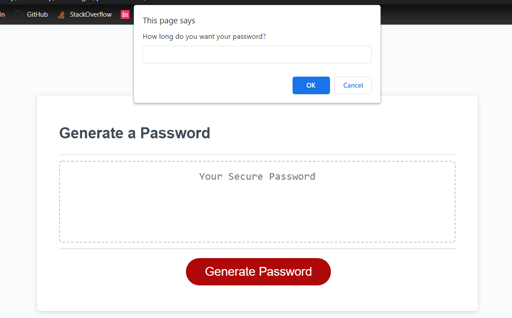

# Password Box

The purpose of this challenge was to create a password generator that modifies the passwords it generates based on criteria the user selects. I learned how to prompt the user to input information that would condittionally change the output generated using JavaScript. 

## Shout Out

Thank you to Joshua Rae for being in a study group with me while we worked on our individual code. 

## Link

[https://tabithaly.github.io/password-box/]